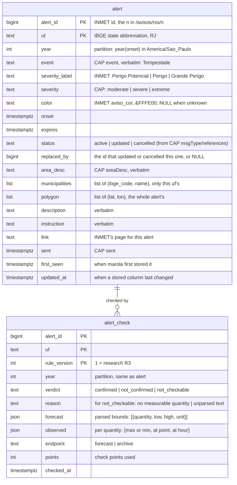

# Data model: alerts

Two tables added to the open ocean data store's DuckLake ([marola-oods spec 001's
data-model](https://github.com/marola-dev/marola-oods/pull/3)), one export per state, and the
page's view of it. `fetch_run` and `fetch_partition` are spec 001's, reused with
`job = 'alerts' | 'alerts-check'` and `source_id = 'inmet-avisos'`.

## The bucket's tree (additions only)

```text
s3://br-open-ocean-data-storage/
  lake/main/alert/uf=RJ/year=2026/…parquet          alert, partitioned by uf, year(onset)
  lake/main/alert_check/uf=RJ/year=2026/…parquet    alert_check, same partitioning
  exports/alerts/rj.json                            the page's data for RJ (contracts/alerts-export.schema.json)
```

## Tables

| Table | One row is | Key | Rows |
|---|---|---|---|
| `alert` | an INMET alert in one state | `(alert_id, uf)` | ~1–2k a year for RJ |
| `alert_check` | marola's verdict on one alert in one state, for one rule version | `(alert_id, uf, rule_version)` | one per alert |



## Enums (persisted by label, never ordinal)

| Enum | Labels |
|---|---|
| `Severity` | `moderate`, `severe`, `extreme` (CAP); `unknown` if CAP has another value |
| `AlertStatus` | `active`, `updated`, `cancelled` |
| `Verdict` | `confirmed`, `not_confirmed`, `not_checkable` |
| `Quantity` | `rain_hour`, `rain_day`, `wind_gust`, `humidity`, `temperature_max`, `temperature_min` |

`active` is INMET's state, not time: whether an alert is live now is `now ∈ [onset, expires)`,
computed at export.

## Lifecycles

- **Insert**: a new `(alert_id, uf)`.
- **Update**: INMET's CAP `Update` names the ids it replaces; the old row gets `status = 'updated'`
  and `replaced_by`, the new id is its own row. `Cancel` sets `status = 'cancelled'`. A cancelled
  or replaced alert is still listed, marked, and is never checked.
- **Same content**: no write, so no snapshot (SC-004).
- **Check**: written once per `(alert_id, uf, rule_version)` when `expires + 2 days ≤ now` (live)
  or at backfill time (archive). Never updated; a new rule version adds rows.
- **Delete**: never. History is kept forever (Q8). DuckLake snapshot expiry (spec 001, 30 days)
  removes old *versions*, not rows.

## The export, per state

`exports/alerts/<uf>.json`, schema in
[contracts/alerts-export.schema.json](contracts/alerts-export.schema.json): `generated_at`, `uf`,
and every alert of that state with its latest-rule check, newest onset first. Polygons are left
out (the page draws none), so RJ's whole history stays a few hundred KB.
